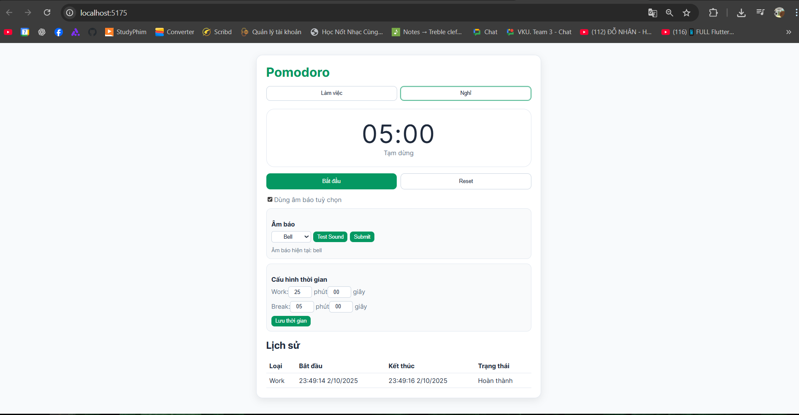

# Pomodoro Capacitor App

Ứng dụng Pomodoro hẹn giờ làm việc và nghỉ ngơi, được xây dựng bằng **React (Vite)** kết hợp với **Capacitor** để triển khai trên **Web, Android, iOS**.

---

## 📌 Mục tiêu
- Tạo bộ hẹn giờ Pomodoro theo chu kỳ 25/5 phút (mặc định).  
- Hỗ trợ đếm ngược ngay cả khi ứng dụng chạy nền.  
- Gửi thông báo + rung khi hết phiên.  
- Cho phép chọn âm báo tùy chỉnh.  
- Lưu lịch sử các phiên làm việc và nghỉ ngơi.  
---

## 📱 Ảnh giao diện

---


## ✨ Chức năng chính
1. **Hẹn giờ Pomodoro**  
   - Người dùng có thể chọn **Làm việc** hoặc **Nghỉ ngơi**.  
   - Bộ đếm ngược hiển thị theo thời gian phút/giây.  

2. **Thông báo & Rung**  
   - Khi hết thời gian, ứng dụng hiển thị **Local Notification**.  
   - Thiết bị rung để cảnh báo (trên Android/iOS).  

3. **Âm báo tùy chọn**  
   - Người dùng có thể bật chế độ **âm báo riêng**.  
   - Chọn âm báo từ danh sách (bell, iphone, chill...).  
   - Có nút **Test Sound** để nghe thử.  

4. **Điều khiển cơ bản**  
   - **Bắt đầu** / **Tạm dừng** / **Reset** bộ đếm ngược.  
   - Cho phép thay đổi thời lượng **Work** và **Break** rồi lưu lại.  

5. **Lịch sử phiên**  
   - Hiển thị danh sách các phiên Pomodoro đã hoàn thành.  
   - Bao gồm: loại (Work/Break), thời gian bắt đầu, kết thúc, trạng thái.  

6. **Âm báo khi hết giờ**  
   - Khi kết thúc một phiên, ngoài thông báo + rung, app sẽ phát nhạc báo.  
   - Có nút **Dừng chuông** khi âm báo đang phát.  

---

## 🛠 Công cụ & Thư viện sử dụng
- **Framework:** [React](https://react.dev/) + [Vite](https://vitejs.dev/)  
- **Capacitor Core:** [@capacitor/core](https://capacitorjs.com/)  
- **Plugin Capacitor:**
  - `@capacitor/local-notifications` → gửi thông báo cục bộ khi hết phiên.  
  - `@capacitor/haptics` → rung cảnh báo khi hết giờ.  
  - `@capacitor/dialog` → hộp thoại xác nhận (bắt đầu, tạm dừng, reset).  
- **State management:** React Hooks (`useState`, `useEffect`, custom hook `usePomodoro`).  
- **Lưu trữ dữ liệu:** `@capacitor/preferences` để lưu trạng thái & lịch sử.  

---

## 🚀 Cách chạy dự án

### 1. Chạy trên Web
```bash
npm install
npm run dev
```
→ Mở [http://localhost:5173](http://localhost:5173)

### 2. Build & chạy trên Android
```bash
npm run build
npx cap sync
npx cap open android
```
→ Android Studio sẽ mở → chọn thiết bị/emulator → Run.  

### 3. Build APK
```bash
cd android
./gradlew assembleDebug
```
→ File APK tại: `android/app/build/outputs/apk/debug/app-debug.apk`


---

## ✅ Tính năng mở rộng
- Âm báo tùy chọn (nhiều loại chuông).  
- Nút **Dừng chuông** khi hết phiên.  
- Toggle **Nghe thử/Dừng** trong phần chọn âm báo.  
- Lưu lịch sử tối đa 100 phiên gần nhất.  
