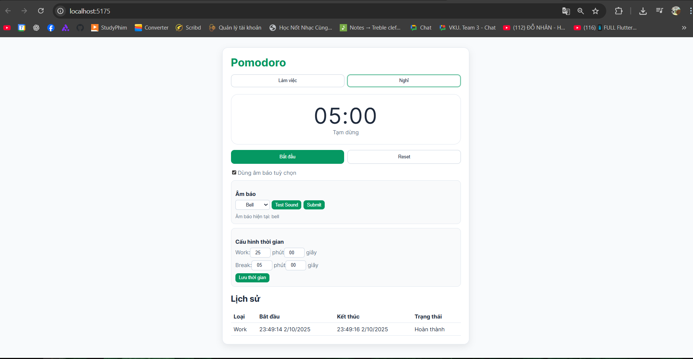
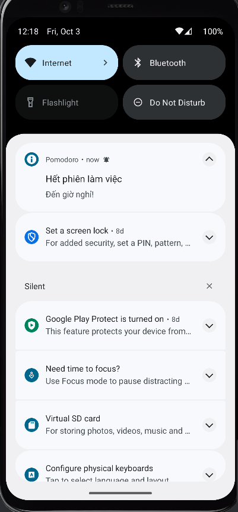
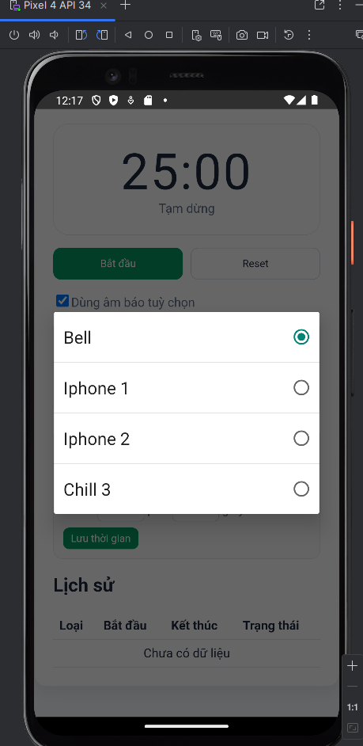
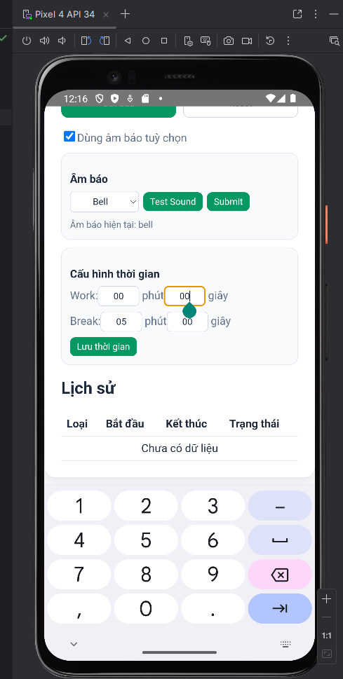
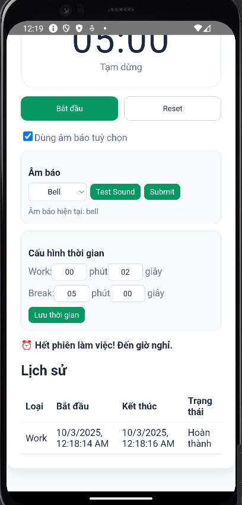

# Pomodoro Capacitor App

Ứng dụng Pomodoro hẹn giờ làm việc và nghỉ ngơi, được xây dựng bằng **React (Vite)** kết hợp với **Capacitor** để triển khai trên **Web, Android, iOS**.

---

## 📌 Mục tiêu
- Tạo bộ hẹn giờ Pomodoro theo chu kỳ **25/5 phút** (mặc định).  
- Hỗ trợ **đếm ngược cả khi chạy nền**.  
- Gửi **thông báo + rung** khi hết phiên.  
- Cho phép chọn **âm báo tùy chỉnh**.  
- Lưu **lịch sử các phiên** làm việc và nghỉ ngơi.  

---

## 📱 Ảnh giao diện

Màn hình chính:

Hộp thoại xác nhận quyền:

Web:

Android Home:

---

## ✨ Chức năng chính

### 1. Hẹn giờ Pomodoro
- Chọn **Work** hoặc **Break**.  
- Hiển thị bộ đếm ngược.  
  

### 2. Thông báo & Rung
- Hết phiên → hiển thị Local Notification + rung.  

### 3. Âm báo tùy chọn
- Bật chế độ **custom sound**.  
- Chọn chuông (bell, iphone, chill...).  
- Có nút **Preview / Stop** để nghe thử.  

### 4. Điều khiển cơ bản
- **Start / Pause / Reset** timer.  
- Thay đổi thời lượng Work/Break rồi lưu.  

### 5. Lịch sử phiên
- Hiển thị danh sách phiên Pomodoro đã hoàn thành.  
- Bao gồm loại, thời gian bắt đầu/kết thúc, trạng thái.  

### 6. Âm báo khi hết giờ
- Hết phiên → thông báo + rung + phát nhạc báo.  
- Có nút **Stop Alarm** để dừng chuông.  

---

## 🎥 Video demo

Link video demo: https://drive.google.com/drive/folders/11XPaKgVBrMgoQnvDi6JjBW00_0UfQLQd

---

## 🛠 Công cụ & Thư viện sử dụng
- **Framework:** React + Vite  
- **Capacitor Core:** @capacitor/core  
- **Plugins:**  
  - `@capacitor/local-notifications`  
  - `@capacitor/haptics`  
  - `@capacitor/dialog`  
- **State management:** React Hooks  
- **Lưu trữ:** @capacitor/preferences  

---

## 🚀 Cách chạy dự án

### Web
npm install
npm run dev
→ Mở http://localhost:5173

Android
npm run build
npx cap sync
npx cap open android

→ Chạy trong Android Studio hoặc emulator.

Build APK
cd android
./gradlew assembleDebug

→ File: android/app/build/outputs/apk/debug/app-debug.apk